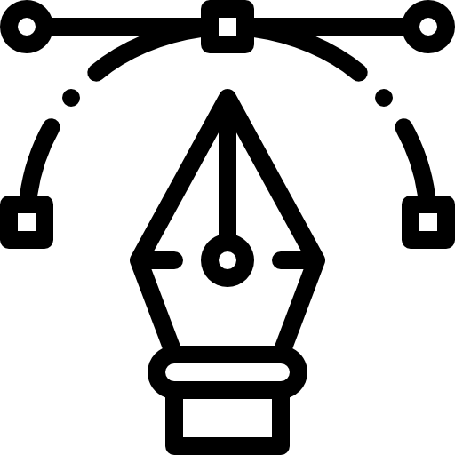

# Personal Portfolio Website

This is a portfolio project by Jaideep Ghungharwal, to be submitted to Oaindrila Das Ma'am

## 🚀 About Me

I'm a full stack developer, and also a passionate graphic designer.

## Acknowledgements

- A HTML and CSS based website
- Interactive UI with active buttons and elements

# Usage

## HTML

```python
<!DOCTYPE html>
<html lang="en">
  <head>
    <meta charset="UTF-8" />
    <meta http-equiv="X-UA-Compatible" content="IE=edge" />
    <meta name="viewport" content="width=device-width, initial-scale=1.0" />

    <title>Jaideep Ghungharwal</title>

    <!-- Fonts -->
    <link rel="preconnect" href="https://fonts.googleapis.com" />
    <link rel="preconnect" href="https://fonts.gstatic.com" crossorigin />
    <link
      href="https://fonts.googleapis.com/css2?family=Montserrat&display=swap"
      rel="stylesheet"
    />

    <!-- Stylesheets -->
    <link rel="stylesheet" href="styles/style.css" />
  </head>
  <body>
    <header>
      <!-- Logo -->
      <a href="#" class="logo"> ferr<span>o</span> </a>
      <ul class="navgation">
        <li>
          <a href="#about">About</a>
        </li>
        <li>
          <a href="#services">Services</a>
        </li>
        <li>
          <a href="#footer">Contact</a>
        </li>
      </ul>
    </header>

    <section class="banner">
      <div class="content">
        <h2>Hi! I'm Jaideep</h2>
        <p>
          Looking for a Web Developer? Guess you have arrived at the right
          destination. <br />
          I'm here to work for you to build and manage a fully function website
          the way you desire. Take a look at my previously worked projects and
          give me a chance to create a masterpiece of your own.
        </p>
        <a href="#projects" class="btn">Projects</a>
      </div>
    </section>

    <!-- About Section -->
    <section class="about" id="about">
      <div class="row">
        <div class="col50">
          <h2 class="titleText"><span>A</span>bout Us</h2>
          <p>
            Here's a place to all the solution for development and design needs.
            Since 2019 we have been known to provide satisfactory work with
            endless support for our clients. All these years we've worked on
            countless projects, and they all ended up with happy customer faces.
            <br /><br />
            With our many years of prior experience in developing beautiful web
            apps and flawless databases its going to be a fun time. Leave all
            your worries to our query basket and just sit back and relax for
            your work to complete.
            <br /><br />
            You don't like our work, no worries, drop a message on any of the
            contact links. 24hrs of assistance has got you all covered. So no
            worries if you don't like our work or you want it too early.
            <br />
            We wish you have a happy time with us, Hey! Don't forget to take a
            look at our services and projects coming up next..
          </p>
        </div>
        <div class="col50">
          <div class="imgBx">
            
          </div>
        </div>
      </div>
    </section>

    <!-- Services Section -->
    <section class="services" id="services">
      <h2 class="titleText"><span>S</span>ervices</h2>
      <p class="text">
        We deliver the following services working on the cutting edge
        techonology of today like React, MongoDB, Express, Node for Web
        Development and we also use powerful creation tools like Blender,
        Illustrator, Figma for our different design needs.
      </p>
      <div class="container">
        <div class="serviceBx">
          <div>
            
            <h2>Development</h2>
          </div>
        </div>
        <div class="serviceBx">
          <div>
            
            <h2>Design</h2>
          </div>
        </div>
        <div class="serviceBx">
          <div>
            
            <h2>Sculpting</h2>
          </div>
        </div>
      </div>
    </section>

    <!-- Projects Section -->
    <section class="projects" id="projects">
      <div class="title">
        <h2 class="titleText"><span>P</span>rojects</h2>
        <p>Take a look at some of my creative projects. I hope you like them</p>
      </div>
      <div class="content">
        <div class="box">
          <div class="imgBx">
            
          </div>
          <div class="text">
            <h3>React App</h3>
          </div>
        </div>
        <div class="box">
          <div class="imgBx">
            
          </div>
          <div class="text">
            <h3>Express App</h3>
          </div>
        </div>
        <div class="box">
          <div class="imgBx">
            
          </div>
          <div class="text">
            <h3>Basic Website</h3>
          </div>
        </div>
        <div class="box">
          <div class="imgBx">
            
          </div>
          <div class="text">
            <h3>Product Design</h3>
          </div>
        </div>
        <div class="box">
          <div class="imgBx">
            
          </div>
          <div class="text">
            <h3>Graphic Illustration</h3>
          </div>
        </div>
        <div class="box">
          <div class="imgBx">
            
          </div>
          <div class="text">
            <h3>Character Modeling</h3>
          </div>
        </div>
      </div>
      <div class="title">
        <a href="#" class="btn"> Github </a>
      </div>
    </section>

    <!-- Footer Section -->
    <footer id="footer">
      <ul class="socialIcons">
        <li>
          <a href="#"><ion-icon name="logo-facebook"></ion-icon></a>
        </li>
        <li>
          <a href="#"><ion-icon name="logo-linkedin"></ion-icon></a>
        </li>
        <li>
          <a href="#"><ion-icon name="logo-instagram"></ion-icon></a>
        </li>
      </ul>
      <p>Copyright ©️ 2022 Ferro | All Rights Reserved</p>
    </footer>

    <!-- Icon Scripts -->
    <script
      type="module"
      src="https://unpkg.com/ionicons@5.5.2/dist/ionicons/ionicons.esm.js"
    ></script>
    <script
      nomodule
      src="https://unpkg.com/ionicons@5.5.2/dist/ionicons/ionicons.js"
    ></script>
  </body>
</html>

```

# CSS

```css
* {
  padding: 0;
  border: 0;
  box-sizing: border-box;
  font-family: "Montserrat", sans-serif;
  scroll-behavior: smooth;
}

body {
  margin: 0;
  /* background: #000; */
  min-height: 200vh;
}

/* Navbar Styles */

header {
  position: absolute;
  left: 0;
  top: 0;
  width: 100%;
  display: flex;
  justify-content: space-between;
  align-items: center;
  transition: 0.6s;
  padding: 40px 100px;
  z-index: 100;
}

header .logo {
  position: relative;
  font-weight: 700;
  color: #fff;
  text-decoration: none;
  font-size: 1.5em;
  text-transform: uppercase;
  letter-spacing: 2px;
  transition: 0.6s;
}

header .logo span {
  color: #ff0157;
}

header ul {
  position: relative;
  display: flex;
  justify-content: center;
  align-items: center;
}

header ul li {
  position: relative;
  list-style: none;
}

header ul li a {
  position: relative;
  margin: 0 15px;
  text-decoration: none;
  color: #fff;
  letter-spacing: 2px;
  font-weight: 500;
  transition: 0.6s;
}

header ul li a:hover {
  color: #ff0157;
  transition: 0.3s;
}

/* Hero */
.banner {
  position: relative;
  width: 100%;
  min-height: 100vh;
  display: flex;
  justify-content: center;
  align-items: center;
  background: url(../assets/background/pexels-picjumbocom-196659.jpg);
  background-size: cover;
  /* opacity: 0.15; */
}

.banner .content {
  max-width: 900px;
  text-align: center;
}

.banner .content h2 {
  font-size: 5em;
  color: #fff;
}

.banner .content p {
  font-size: 1em;
  color: #fff;
}

/* Red Button */
.btn {
  font-size: 1em;
  color: #fff;
  background: rgba(255, 1, 87, 0.5);
  border-radius: 3px;
  display: inline-block;
  padding: 10px 30px;
  margin-top: 20px;
  text-transform: uppercase;
  text-decoration: none;
  letter-spacing: 2px;
  transition: 0.6s;
}

.btn:hover {
  letter-spacing: 6px;
}

/* Other Common Classes */
section {
  padding: 100px;
}

.row {
  position: relative;
  width: 100%;
  display: flex;
  justify-content: space-between;
}

.row .col50 {
  position: relative;
  width: 48%;
}

.titleText {
  color: #111;
  font-size: 2em;
  font-weight: 300;
}

.titleText span {
  color: #ff0157;
  font-weight: 700;
  font-size: 1.5em;
}

.row .col50 .imgBx {
  position: relative;
  width: 100%;
  height: 100%;
}

.row .col50 .imgBx img {
  position: absolute;
  top: 0;
  left: 0;
  width: 100%;
  height: 100%;
  object-fit: cover;
}

.title {
  width: 100%;
  display: flex;
  justify-content: center;
  align-items: center;
  flex-direction: column;
}

/* Services Section */
.services {
  background: #d0d0d0;
  padding: 100px;
  text-align: center;
}

.services .container {
  width: 100%;
  display: flex;
  justify-content: space-between;
  align-items: center;
  flex-wrap: wrap;
  margin-top: 60px;
}

.services .container .serviceBx {
  position: relative;
  background: #fff;
  width: 350px;
  height: 400px;
  display: flex;
  justify-content: center;
  align-items: center;
  box-shadow: 0 5px 35px rgba(0, 0, 0, 0.08);
}

.services .container .serviceBx img {
  max-width: 100px;
}

.services .container .serviceBx h2 {
  font-weight: 500;
  font-size: 20px;
  letter-spacing: 1px;
}

/* Projects Section */
.projects {
  padding-top: 300px;
  margin-top: -300px;
  background: #fff;
}

.projects .content {
  display: flex;
  justify-content: center;
  flex-direction: row-reverse;
  flex-wrap: wrap;
  margin-top: 40px;
}

.projects .content .box {
  width: 340px;
  margin: 20px;
  border: 15px solid #fff;
  box-shadow: 0 5px 35px rgba(0, 0, 0, 0.08);
}

.projects .content .box .imgBx {
  position: relative;
  width: 100%;
  height: 300px;
}

.projects .content .box .imgBx img {
  position: absolute;
  top: 0;
  left: 0;
  width: 100%;
  height: 100%;
  object-fit: cover;
  filter: grayscale(70%);
  transition: 0.6s;
}

.projects .content .box .imgBx img:hover {
  filter: grayscale(0);
  transform: scale(1.1);
  transition: 0.6s;
}

.projects .content .box .text {
  padding: 15px 0 5px;
}

.projects .content .box .text h3 {
  font-weight: 400;
  color: #111;
}

.projects .btn {
  background: #ff3d6e;
}

/* Footer Section */
footer {
  position: relative;
  width: 100%;
  background: #ff3d6e;
  min-height: 100px;
  padding: 20px 50px;
  display: flex;
  justify-content: center;
  align-items: center;
  flex-direction: column;
}

footer .socialIcons {
  position: relative;
  display: flex;
  justify-content: center;
  align-items: center;
  margin: 10px 0;
}

footer .socialIcons li {
  list-style: none;
}

footer .socialIcons li a {
  font-size: 2em;
  color: #fff;
  margin: 0 10px;
  display: inline-block;
  transition: 0.6s;
}

footer .socialIcons li a:hover {
  transform: translateY(-10px);
}

footer p {
  color: #fff;
  text-align: center;
  margin-top: 15px;
}
```

## Contributing

Pull requests are welcome. For major changes, please open an issue first to discuss what you would like to change.

Please make sure to update tests as appropriate.

## Authors

- [@ferrofalcon](https://www.github.com/FerroFalcon)
